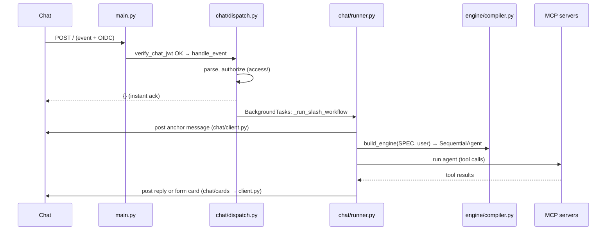

# Code Walkthrough — entry point to endpoint

A guided tour of one request as it travels through `agentic-backend/`, naming
the exact file and function at each hop. Read this once and the folder layout
will make sense. For the deeper "why" behind any step, follow the links into
[`Architecture.md`](./Architecture.md) and [`Workflow-Engine.md`](./Workflow-Engine.md).

## The 10-second model

A Google Chat message arrives → the backend verifies it, figures out which
**workflow** the user invoked, and runs that workflow's **agent** → the agent's
reply is posted back to Chat. Everything heavy runs *after* the webhook has
already returned `{}`, on a background task, so Chat never sees a slow response.

```
Chat ──HTTP POST──► main.py ──► chat/ (verify, parse, route, authorize)
                                   │  returns {} immediately
                                   └──► background task:
                                          build the agent (engine + workflows)
                                          run it (tools → MCP servers)
                                          post the reply (chat/client.py)
```

## The folder map (who owns what)

| Folder | Responsibility |
| --- | --- |
| `main.py` | The FastAPI app. The only file at the root. |
| `chat/` | All Google Chat I/O: verify, parse, route, run, post, and form cards. |
| `access/` | Who is allowed to run which command. |
| `sessions/` | Per-thread multi-turn memory (ADK sessions). |
| `clients/` | Outbound clients: `agent.py` (builds ADK agents + MCP toolsets), `mcp_client.py` (direct MCP calls). |
| `engine/` | The composable engine framework: turns an `EngineSpec` into a runnable agent. |
| `workflows/` | One package per slash command; each *declares* an `EngineSpec`. |
| `config/`, `observability/` | Settings; logging + tracing setup. |

## The walkthrough (a `/rfi` invocation, end to end)

### 1. Entry — `main.py`
The FastAPI app exposes a single `POST /`. Before the body is even parsed, the
`verify_chat_jwt` dependency runs.

### 2. Verify the caller — `chat/security.py`
`verify_chat_jwt` checks the Google OIDC token's signature, audience, and that
the sender is Google Chat's system account. A bad token → `401`, body never read.
*(Invariant: the backend never trusts a payload before this passes.)*

### 3. Parse + route — `chat/dispatch.py` (+ `chat/events.py`)
`handle_event` is the public entry. `chat/events.py` parses the raw payload into
a typed object (user email, thread, slash `commandId`, prompt text). `_handle_message`
then decides the path:
- **Reserved commands** (`/exit`, `/help`, `/grant`, `/revoke`, `/list-access`) →
  handled inline in `chat/reserved.py`, never touch the LLM, reply synchronously.
- **A real slash command** (like `/rfi`) → look it up, authorize, enqueue.

### 4. Look up the workflow — `workflows/__init__.py`
`get_workflow(command_id)` returns the `Workflow` for `/rfi` (id 6) from the
`WORKFLOWS` dict. A `Workflow` (`workflows/_base.py`) is just metadata plus a
`build_agent(user_email)` factory.

### 5. Authorize — `access/policy.py` + `access/store.py`
`authorize(...)` asks the DB-backed `AccessStore` for this command's rules and
combines them with the workflow's `default_access`. Denied → audit log + a
rejection message. Allowed → continue.

### 6. Return now, work later — `chat/dispatch.py` → `chat/runner.py`
The webhook **returns `{}` synchronously** and enqueues `_run_slash_workflow`
onto FastAPI `BackgroundTasks`. (Multi-tool agent runs are far slower than
Chat's ~6 s "not responding" timer — so we ack instantly and reply later.)

### 7. The background task — `chat/runner.py`
`_run_slash_workflow` does the real work:
1. Posts a **public anchor message** via `chat/client.py` and captures the
   thread Chat creates — this thread becomes the session key *and* the reply
   target. *(Why: slash messages are private and can't take threaded replies.)*
2. Resolves a fresh ADK session for that thread — `sessions/` (`SessionStore.resolve`).
3. Runs any **pre-run hook** for this command — `chat/cards/` `prepare_slash_workflow`
   (for `/rfi`, this downloads the attached `.xlsx`/`.docx` and seeds state).
4. Builds and runs the agent (steps 8–10).
5. Hands the result to the **post-run hook** (step 11).

### 8. Build the agent — `clients/agent.py` → `engine/compiler.py`
`build_agent_for_workflow` calls `workflow.build_agent(user_email)`, which for an
engine workflow is `engine.build_engine(SPEC, user_email)`. The spec lives in
`workflows/rfi_engine/agents.py` as `RFI_SPEC` — an ordered list of typed stages.

### 9. Compile the spec — `engine/compiler.py` (+ `engine/registry.py`)
`build_engine` walks the spec and turns each stage into a real ADK agent:
`LlmStageSpec` → `LlmAgent`, `GateStageSpec` → `GateAgent`, `FormGateStageSpec` →
`FormGate`, `CustomStageSpec` → a registered factory, etc. The code-y bits each
stage references by string key (output schemas, gate checks, predicates, prompts,
custom agents) are resolved from `engine/registry.py`. Toolsets are built by
`clients/agent.py` (`context_toolset` / `action_toolset`). Result: a
`SequentialAgent`. *(See [`Workflow-Engine.md`](./Workflow-Engine.md) §4b.)*

### 10. Run the agent — `chat/runner.py` `_run_agent`
An ADK `Runner` drives the `SequentialAgent` one stage at a time. LLM stages call
tools that reach the **MCP servers** (Context MCP for reads, Action MCP for
writes); deterministic stages run pure Python. A few flows the backend must drive
itself (e.g. calendar creation) call `clients/mcp_client.py` directly. State flows
between stages through `session.state` keys (`workflows/common/state_keys.py`).

### 11. Post the result — `chat/cards/` → `chat/client.py`
`post_slash_workflow_result` routes by `command_id` to the workflow's post-run
hook. It inspects `session.state`: if a `FormGate` left a `*_STATE = "PENDING"`
marker, it posts a **form card** (e.g. the `/rfi` scope form) and stops; otherwise
it posts the final reply text. Both go out via `chat/client.py`.

### 12. Suspend / resume (the human-in-the-loop loop)
When a form is posted, the run is *suspended*. The user's card submit comes back
as a `CARD_CLICKED` event → `chat/dispatch.py` → `chat/cards/` handler (keyed by
the button's action function). The handler patches `session.state` to `RESOLVED`
and **re-runs the same pipeline**. Every stage is idempotent, so completed work
isn't redone; the `FormGate` now passes through and the pipeline continues from
where it paused.



## "Where do I look for…?"

| I want to… | Go to |
| --- | --- |
| Change what a workflow *does* | `workflows/<engine>/agents.py` (the `EngineSpec`) |
| Add a new stage *type* | `engine/spec.py` + `engine/compiler.py` |
| Reuse a gate/assembler primitive | `engine/form_gate.py`, `engine/assembler.py`, `workflows/common/` |
| Change a prompt | the `EngineSpec`'s `instruction_text`, or its registered instruction provider in `workflows/<engine>/agents.py` |
| Change how cards look / resume | `chat/cards/<engine>.py` |
| Change auth / who can run what | `access/policy.py`, `access/store.py` (CLI: `python -m access.manage`) |
| Change model / MCP wiring | `clients/agent.py`, `config/` |
| Add a slash command | new `workflows/` package + import in `workflows/__init__.py` + register the `command_id` in the Chat console |

## Related
- [`Architecture.md`](./Architecture.md) — full system, security model, invariants.
- [`Workflow-Engine.md`](./Workflow-Engine.md) — dispatch/session flowcharts and the `EngineSpec` → agent compilation (§4b).
- [`Meeting-Workflow.md`](./Meeting-Workflow.md) — one engine drawn out in detail.
