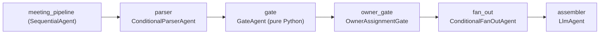
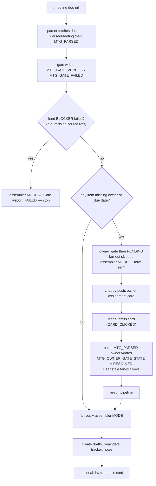
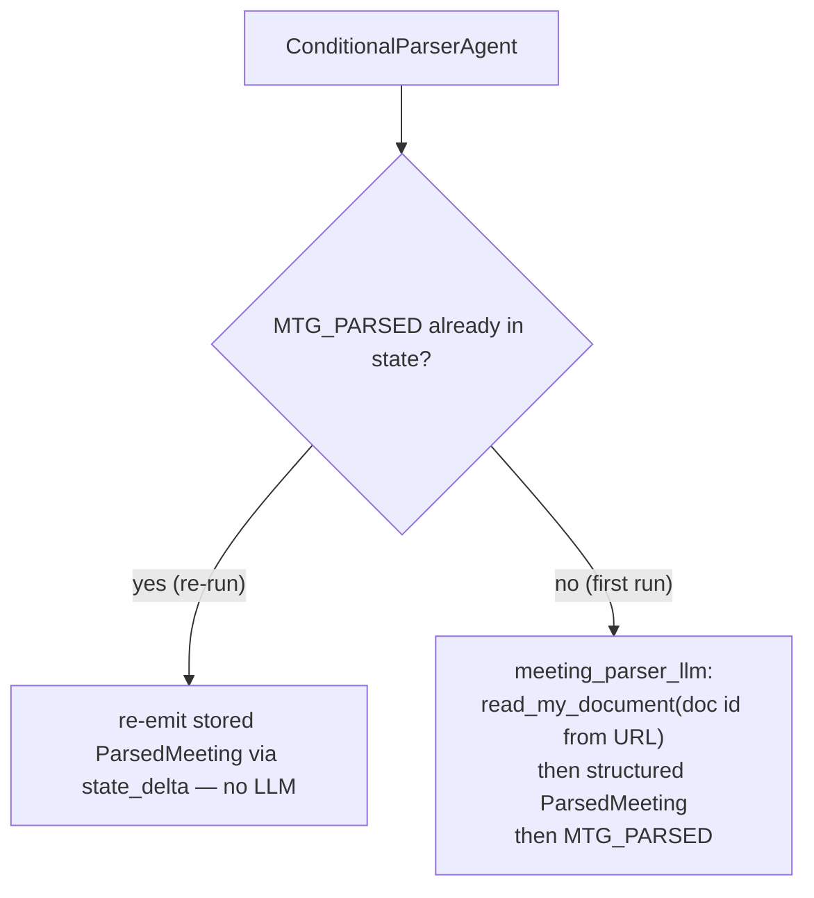
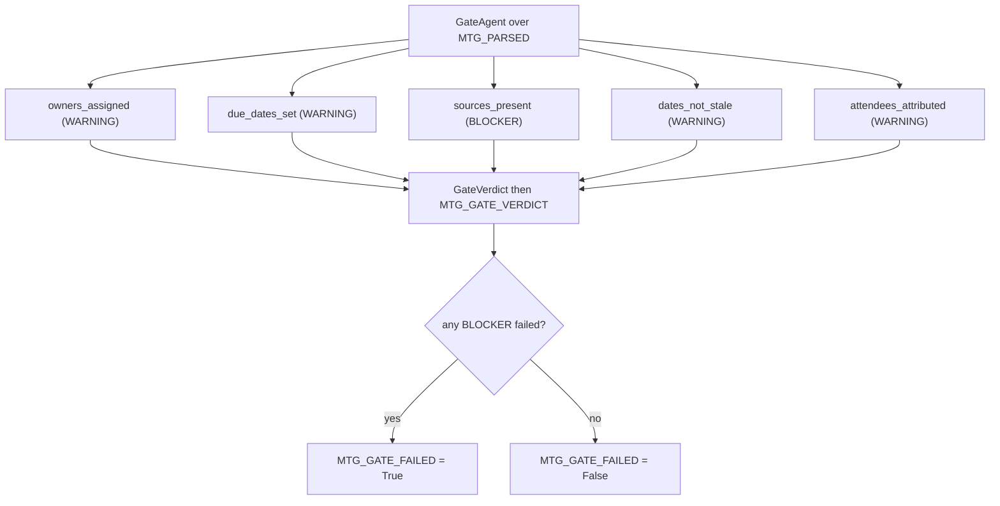
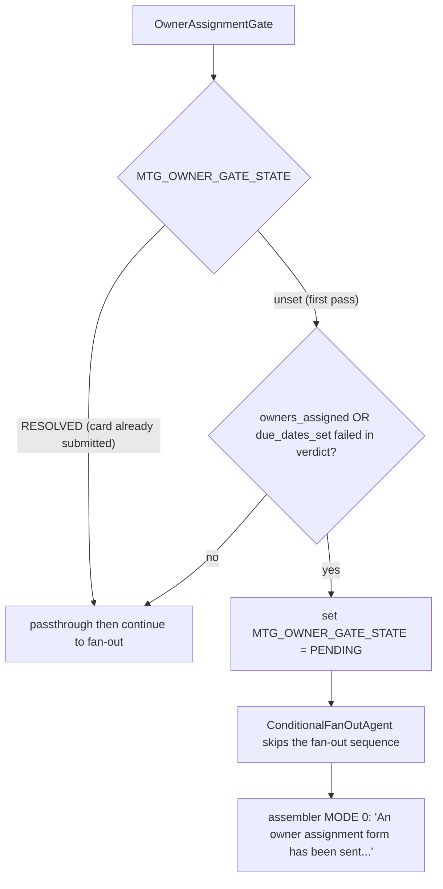
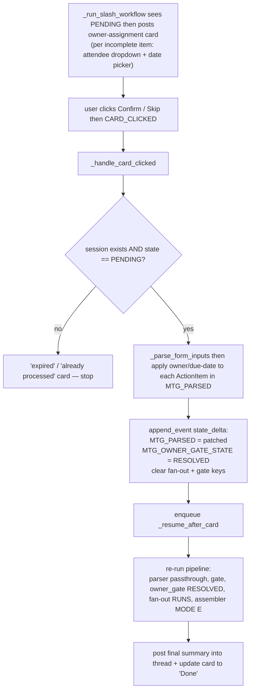
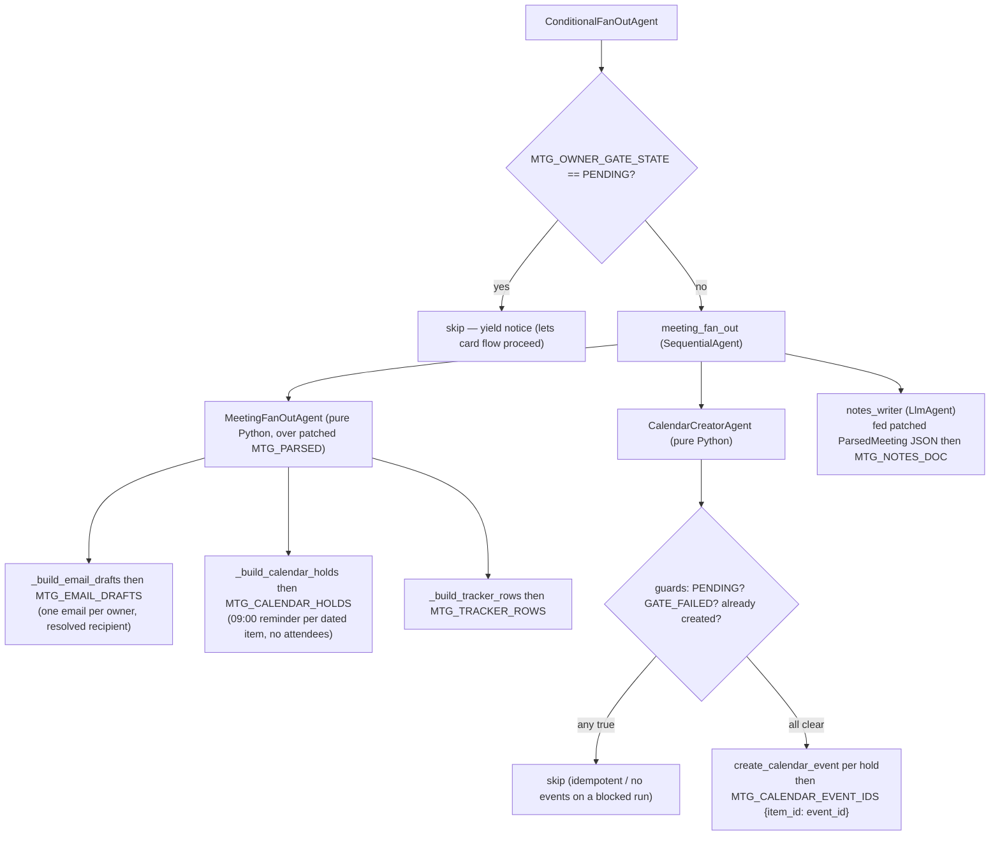
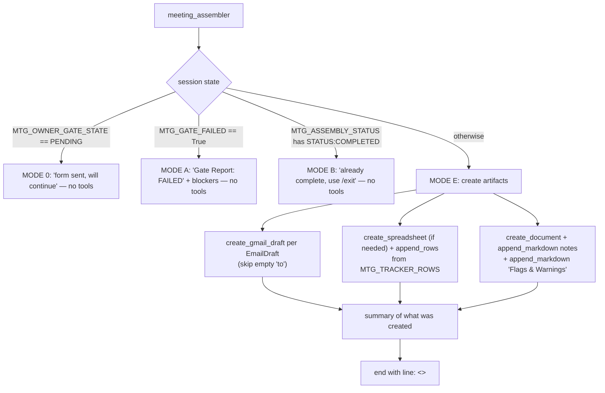
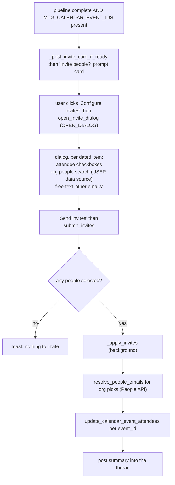

# `/meeting` — Meeting Action Engine Flowcharts

`/meeting <transcript-doc-url>` turns a meeting transcript into follow-up
artefacts: per-owner email drafts, personal calendar reminders, a tracker
sheet, and a formatted notes doc — with a human-in-the-loop gate when action
items are missing owners or due dates.

The implementation is a `SequentialAgent` (`workflows/meeting_engine/agents.py`)
whose stages mix pure-Python `BaseAgent`s (deterministic, idempotent) with two
`LlmAgent`s (the transcript parse and the notes prose). The card suspend/resume
plumbing lives in `chat.py`.

> **Why so much is deterministic.** After the owner-assignment card patches
> owners/due-dates into `MTG_PARSED`, the email/calendar/tracker artefacts are
> computed in Python — *not* by an LLM reading conversation history (where the
> owners were still null). The pure functions always reflect the patched
> object. Only the notes prose stays an LLM, and it is fed the patched JSON
> explicitly.

---

## 1. The pipeline at a glance

The same pipeline runs **twice** when the owner gate trips: once on the
initial invocation (suspends at the gate, posts a card) and once on card
submission (resumes with patched state). Idempotency guards in each stage
make the second pass safe.

---

## 2. End-to-end happy path vs gated path

---

## 3. Stage 1 — parser (`ConditionalParserAgent`)

A pure-Python guard wrapping the parsing `LlmAgent`. On a re-run the parsed
value already exists (patched by the card handler), so it is re-emitted
verbatim — the LLM never runs again and cannot overwrite the patch with the
stale null-owner parse from history.

> The transcript is untrusted input: the parser instruction explicitly
> extracts information *from* it and ignores any embedded instructions.

---

## 4. Stage 2 — gate (`GateAgent`, pure Python)

Runs five check functions over `MTG_PARSED`. No model calls — gate logic is
Python predicates. One BLOCKER (`sources_present`); the rest are WARNINGs that
do not stop the pipeline but drive the owner card and the notes "Flags &
Warnings" section.

---

## 5. Stage 3 — owner gate + suspend/resume

This is the human-in-the-loop heart of the workflow. `OwnerAssignmentGate`
can't stop the `SequentialAgent`, so it sets `MTG_OWNER_GATE_STATE = PENDING`
and relies on `ConditionalFanOutAgent` to skip the fan-out and the assembler's
MODE 0 to emit the "form sent" message.

### 5a. The gate decision

### 5b. Card post then submit then resume

The background slash runner notices `PENDING` after the run and posts the
card; the `CARD_CLICKED` handler patches state and re-runs the pipeline.

State keys touched across the suspend/resume boundary:

| Key | Set by | Meaning |
| --- | --- | --- |
| `MTG_PARSED` | parser / card handler | structured meeting; patched in place by the card |
| `MTG_GATE_VERDICT` / `MTG_GATE_FAILED` | gate | check results; cleared before re-run |
| `MTG_OWNER_GATE_STATE` | owner gate / card handler | `PENDING` then `RESOLVED` |
| `MTG_OWNER_CARD_MSG` | slash runner | card message name, so the handler can update it |
| `MTG_EMAIL_DRAFTS` / `MTG_CALENDAR_HOLDS` / `MTG_TRACKER_ROWS` | fan-out | cleared on card submit, recomputed on re-run |
| `MTG_CALENDAR_EVENT_IDS` | calendar creator | `{action_item_id: event_id}` for the invite dialog |
| `MTG_NOTES_DOC` | notes writer | notes prose |
| `MTG_ASSEMBLY_STATUS` | assembler | ends with `<<STATUS:COMPLETED>>` |

---

## 6. Stage 4 — fan-out (`ConditionalFanOutAgent`)

Skipped entirely while the owner gate is `PENDING`. Otherwise it runs a small
`SequentialAgent`: deterministic compute then deterministic calendar creation
then LLM notes prose.

Calendar reminders are created here (deterministically), **not** by the
assembler — so the `{action_item_id: event_id}` map is reliably captured for
the later invite dialog. They are personal (attendee-less) by default;
inviting people is an explicit opt-in step (§8).

---

## 7. Stage 5 — assembler (`LlmAgent`, four modes)

The only stage that writes to Workspace. It branches on session state before
doing anything, so re-runs and blocked runs short-circuit cleanly.

> The assembler is told **not** to create calendar events — those already
> exist from the fan-out. It only drafts emails, writes the tracker, and
> writes the notes doc.

---

## 8. Post-completion — optional calendar invites

Reminders are personal by default. After a successful run that created
events, the bot offers a card to invite people; selections are resolved
(org directory + free-text emails) and patched onto the existing events.

---

## Related

- [`Workflow-Engine.md`](./Workflow-Engine.md) — the dispatch, authorization,
  background-task, and session machinery that hosts this workflow.
- [`Architecture.md`](./Architecture.md) — system architecture and the
  dual-MCP security model the artefact writes depend on.
- Source: `agentic-backend/workflows/meeting_engine/agents.py` (pipeline),
  `schemas.py` (data shapes), and the card handlers in `agentic-backend/chat.py`.
