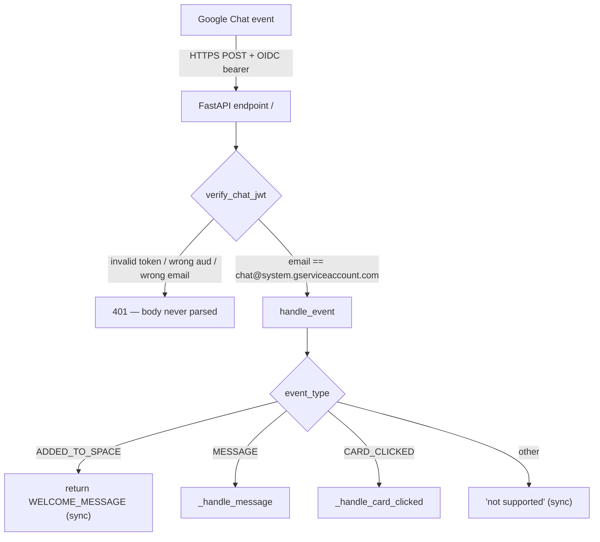
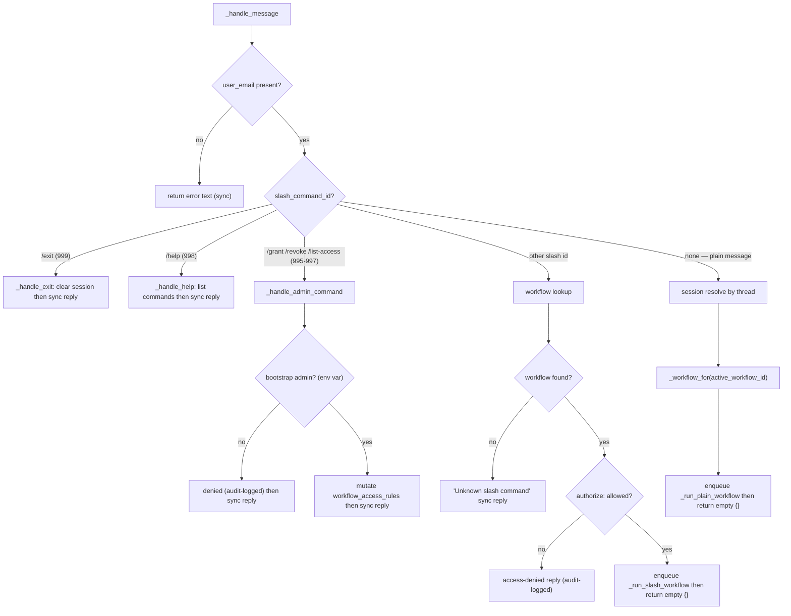
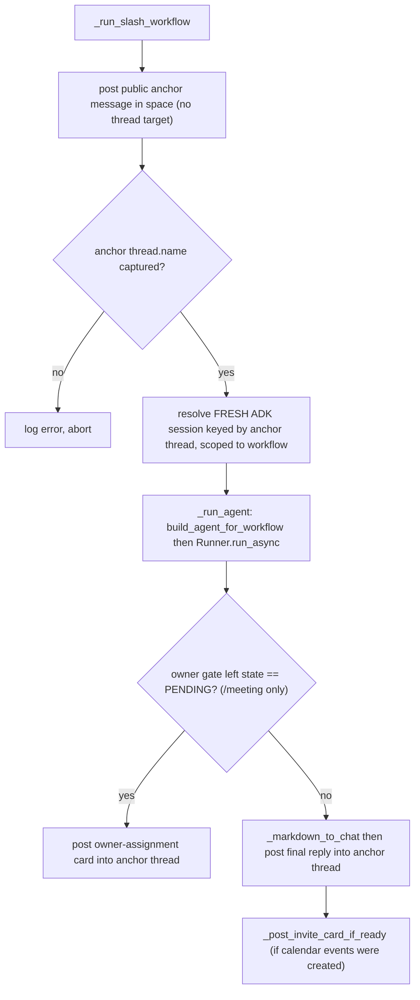
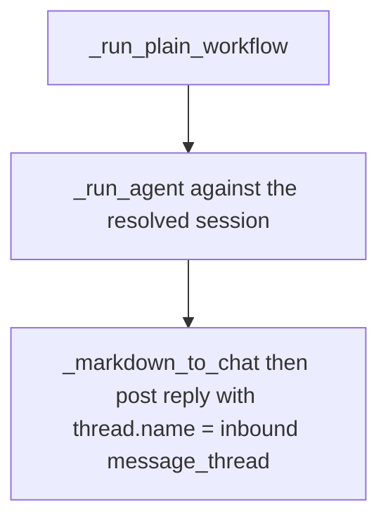
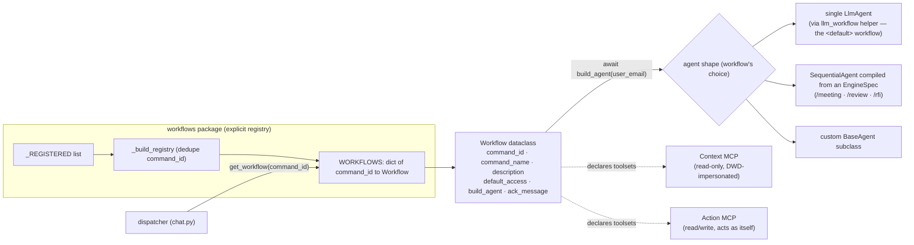
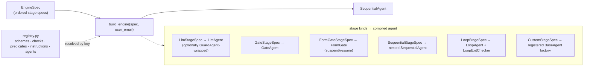
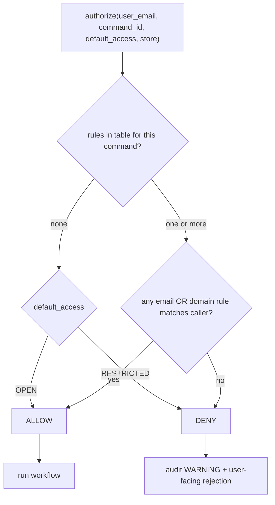
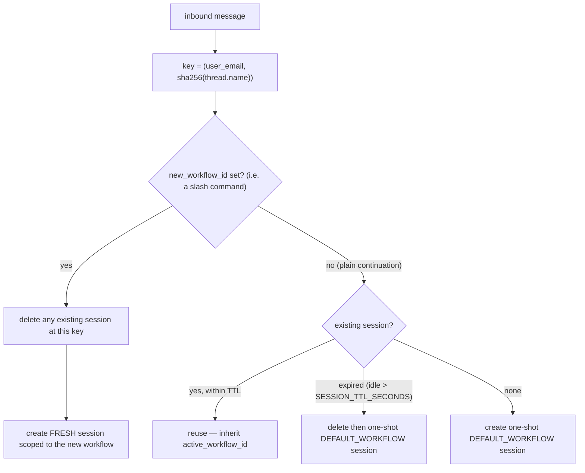

# Workflow Engine — Flowcharts

How the slash-command workflow engine behaves end to end: from an inbound
Google Chat event, through dispatch and authorization, to the background
agent run that posts the reply. This is the companion "how it flows" view
of the **Workflow engine** section in [`Architecture.md`](./Architecture.md);
read that for the prose rationale and the security invariants.

The engine itself is intentionally small: it looks up a `Workflow` by
`command_id`, asks it to build an ADK agent, runs whatever comes back, and
posts the result asynchronously. Everything below is that loop drawn out.

---

## 1. Request lifecycle (top level)

Every request enters through the single FastAPI POST endpoint. The JWT is
verified *before* the body is parsed; only then does `handle_event` route by
event type.

---

## 2. MESSAGE dispatch decision tree

`_handle_message` separates the fast synchronous paths (reserved commands)
from the LLM paths (slash + plain), which always return an empty envelope and
do their work in a `BackgroundTasks` job.

Reserved commands (`/exit`, `/help`, and the three admin commands) never
touch the LLM and never use the background path — their replies are static
and return straight from the webhook.

---

## 3. The two background paths

The webhook has already returned. These run after the response is sent, and
post their results back via the Chat REST API. CPU must stay allocated
(`--no-cpu-throttling`) so these outbound TLS handshakes don't stall.

### 3a. Slash invocation — the "Option C" public anchor flow

A slash invocation is private to the invoker, and Chat rejects threaded bot
replies into a private message. So the bot posts a *new public anchor
message*, captures the thread Chat creates for it, and uses that thread as
both the session key and the reply target for everything that follows.

### 3b. Plain continuation — reply directly in the existing thread

A follow-up typed inside an existing thread already has a usable
`thread.name`, so no anchor dance is needed.

Both paths converge on `_run_agent`, which builds the workflow's agent fresh,
drives one prompt through `Runner.run_async`, logs each ADK event
(tool calls, tool responses, state deltas), and returns the final text.

---

## 4. Registry & agent build

One module per command exposes a `WORKFLOW` constant. The package `__init__`
imports them explicitly into `_REGISTERED`, validates uniqueness, and indexes
by `command_id`. The dispatcher never knows *which* ADK shape a workflow
builds — that's the workflow's own choice.

A workflow scoped to one toolset is *structurally* incapable of using the
other — the unused MCP is never attached to the agent.

---

## 4b. Composable engine (`EngineSpec`)

The three multi-stage workflows aren't hand-wired — each is declared as an
`EngineSpec` (`engine/spec.py`): an ordered list of typed stage specs.
`build_engine(spec, user_email)` (`compiler.py`) compiles it into the
`SequentialAgent` the dispatcher runs. Stages name their code dependencies by
string key into `engine/registry.py`, so the structure + prompts read
as data while schemas, gate checks, predicates, instruction providers and
bespoke agents stay in code.

Two reusable primitives live alongside the compiler: `FormGate` (the
generalised suspend/resume gate that replaced the per-engine guidance/gap/owner
gates) and `IdempotentAssembler` (the completed-marker-guarded deterministic
writer). Adding a workflow = write a spec + register any new component; adding a
*capability* the framework lacks = one new stage class, reused thereafter.

---

## 5. Access control

Workflow *definitions* live in code; *who may invoke them* lives in the
database. `authorize` combines the table rules with the workflow's
code-declared `default_access` (the empty-table behaviour).

| `default_access` | rules in table | outcome        |
| ---------------- | -------------- | -------------- |
| `OPEN`           | none           | allow          |
| `OPEN`           | one or more    | evaluate rules |
| `RESTRICTED`     | none           | deny           |
| `RESTRICTED`     | one or more    | evaluate rules |

The three admin commands (`/grant`, `/revoke`, `/list-access`) are a separate
gate entirely: governed by `BOOTSTRAP_ADMIN_EMAILS` env var, **not** by the
rules table they manage — so a corrupted table can never lock admins out.

---

## 6. Session lifecycle (multi-turn)

Chat marks `slashCommand` only on the first message; follow-ups are plain
`MESSAGE` events. Sessions are keyed by `(user_email, sha256(thread.name))`
and carry the active workflow's `command_id` in `Session.state`, so a thread
stays inside its workflow across turns.

Because a slash command always deletes and recreates the session, workflow
boundaries reset conversation history: `/review`'s prompt never inherits
`/meeting`'s tool-call history. `/exit` simply deletes the thread's session.

---

## Related

- [`Architecture.md`](./Architecture.md) — full system architecture, cloud
  resources, IAM, and the operating invariants.
- [`Meeting-Workflow.md`](./Meeting-Workflow.md) — the `/meeting` pipeline
  (`SequentialAgent` with a gate, a suspend/resume card, and deterministic
  fan-out) drawn out in detail.
